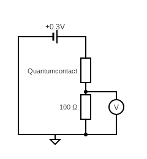
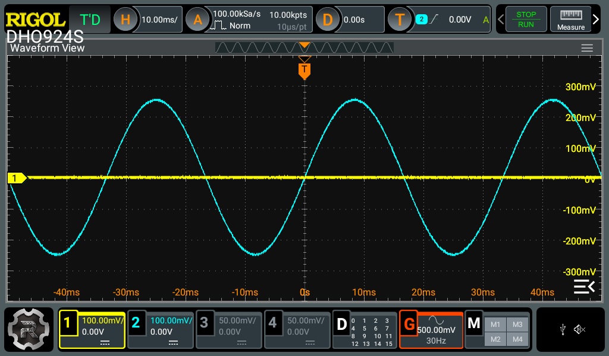
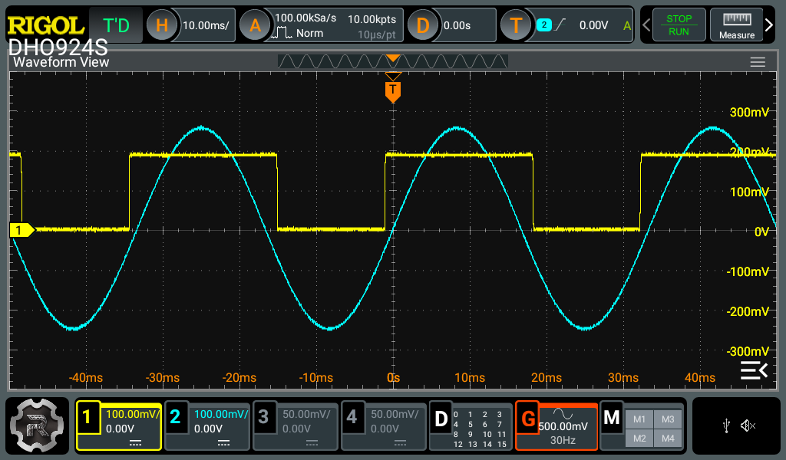
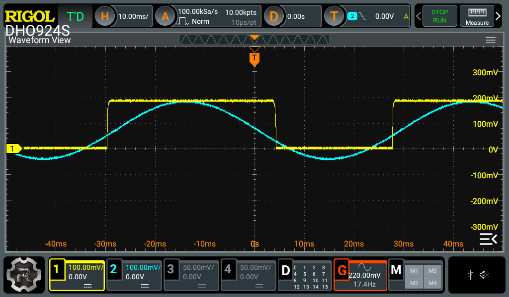
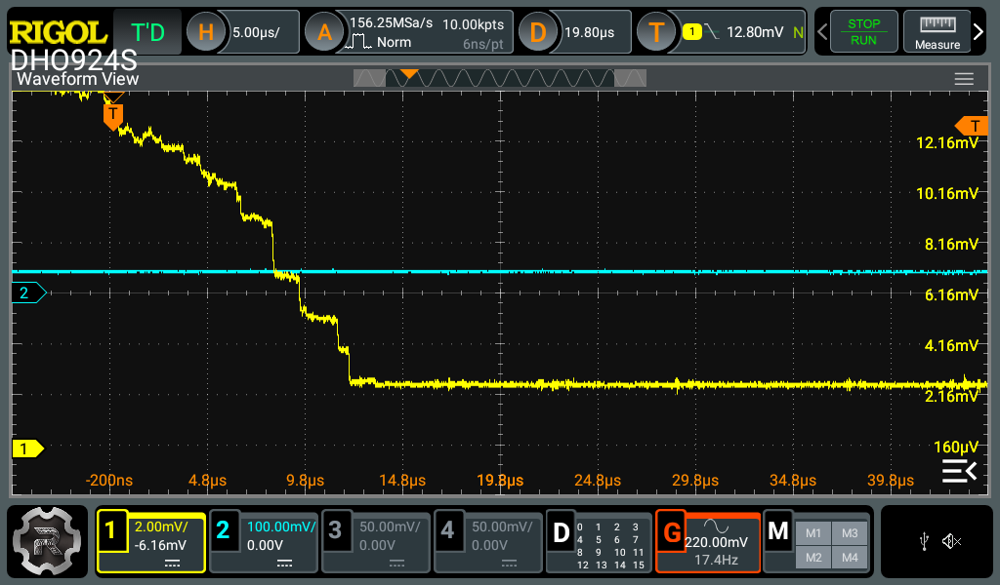

# Quantum conductantie
practicumhandleiding

## Inleiding

Bij bijvoorbeeld een lichtschakelaar is het de bedoeling dat, bij het
sluiten van de schakelaar, een groot aantal atomen van de twee contacten
elkaar raken en zodoende zorgen voor een brug voor de elektronenstroom.

Maar wat gebeurt er op het moment dat maar schakelaar gaat sluiten: Er
zijn dan in eerste instantie maar enkele atomen die voor het eerste
contact zorgen. Even zo goed geldt bij het verbreken van het contact
hetzelfde: Er kan zelfs nog maar één enkel atoom zijn voordat het
contact wordt verbroken. Er kunnen op dat moment bijzondere (quantum)
effecten optreden, vergelijkbaar met de effecten die optreden als je
draden zo dun mogelijk maakt, zoals bij de contacten in de huidige
computerchips. Waar is de ondergrens?

## Doel

In dit experiment wordt onderzocht wat quantum geleiding betekent bij
twee vergulde contacten en wordt de bijbehorende quantumweerstand
bepaald.

## Theorie

Bij dit experiment wordt gebruik gemaakt van een
spanningsdelerschakeling zoals hieronder is afgebeeld om de spanning te
meten tijdens het maken en vooral het verbreken van het contact.  
Bij een spanningsdeler geldt:
```{math}
U_{meet} = \frac{R_{2}}{R_{1} + R_{2}} \cdot U_{tot}
```
Hieruit valt af te leiden dat:

```{math}
R_{1} = \frac{R_{2}\left( U_{tot} - U_{meet} \right)}{U_{meet}}
```

**Opdracht**

Laat deze afleiding zien.




*Wanneer wordt ingezoomd op het verbrekende contact kom je uiteindelijk
in de wereld van atomen. De contacten zijn van goud. Goud oxideert niet
en is een goede geleider uit dezelfde groep van het periodiek systeem
als koper en zilver. Goud is een zacht metaal dat op atomair niveau bij
het verbreken als kauwgom uit elkaar getrokken wordt. De laag atomen
wordt dan dunner en dunner tot er vlak voor het verbreken nog maar een
verbinding van een enkel atoom overblijft. Goud heeft net als koper en
zilver maar één geleidingselektron. We zien dus het afnemen van het
aantal geleidingskanalen in de tijd als het verbreken van parallel
geschakelde geleidingskanalen of weerstanden. Aan het begin van het
spoor is de situatie te ingewikkeld. Er doen dan te veel atomen mee in
de geleiding, die elkaar allemaal ook nog beïnvloeden. Als er veel
weerstanden parallel staan wordt R<sub>1</sub> in de spanningsdeler ook
klein ten opzichte van de vaste weertand (R<sub>2</sub> =100 Ohm) en die
is dan niet meer lineair. De staart van het signaal is veel netter. De
stapjes zijn daar goed onderscheidbaar en allemaal ongeveer even groot.
We kunnen de stapjes verklaren door nog eens naar de spanningsdeler te
kijken en voor de onbekende weerstand n parallel geschakelde
geleidingskanalen te invullen.*

``` {math}
U_{meet} = \frac{R_{2}}{\frac{R_{1}}{n} + R_{2}} \cdot U_{tot}
```

*Deze relatie tussen U<sub>meet</sub> en R<sub>1</sub> is niet lineair,
maar bij onze keuze van R<sub>2</sub> zijn de eerste tien stapjes
nagenoeg even groot. We kunnen zo een weerstand van ongeveer 13 kΩ
meten. 

**Opdracht**

Schrijf deze formule als R<sub>1</sub> = ...


*De weerstand is uit te drukken in fundamentele natuurconstanten:*

``` {math}
R_{1} = \frac{h}{2e^{2}}
```

*De factor twee in de noemer laat zien dat het geleidingskanaal ruimte
biedt aan twee spintoestanden tegelijkertijd. Bij quantum denk je
misschien aan heel extreme getallen, maar deze relatie levert een
weerstand van 13 kΩ is een heel normale weerstand. We hebben dan ook
geen bijzondere elektronica nodig hebben om dit quantumgetal te meten.*

*Je kunt uitrekenen hoeveel elektronen er per seconde door deze atomaire
draad gaan. Doe dit ...*

*Als je dit experiment zou uitvergroten tot een dikke draad zouden er
gigantische stromen lopen die de draad meteen zouden doen smelten.
Waarom smelt de draad nu niet? Bij een stroom in een dikke draad bewegen
de elektronen niet-elastisch door het metaalrooster. In een quantum
verklaring volstaat een klassiek (Drude) botsingmodel niet meer. Een
uitleg met valentie- en geleidingsbanden is meer op zijn plaats. 


<div style="display: flex; justify-content: center;">
<div style="position: relative; width: 70%; height: 0; padding-bottom: 56.25%;">
<iframe width="560" height="315" src="https://www.youtube.com/embed/KGJqykotjog?si=uaPMSdXJ0Su2aQ61" title="YouTube video player" frameborder="0" allow="accelerometer; autoplay; clipboard-write; encrypted-media; gyroscope; picture-in-picture; web-share" referrerpolicy="strict-origin-when-cross-origin" allowfullscreen></iframe>
</div>
</div>

*Onregelmatigheden in het rooster vormen de barrières en zijn de oorzaak
van warmteontwikkeling. De atomaire draad is kort (veel korter dan de vrije
weglengte). De warmteontwikkeling vindt wel verderop plaats, maar daar
is de draad weer dikker en kan de warmte in de bulk van het materiaal
worden opgenomen. Vandaar dat dit experiment gewoon bij
kamertemperatuur, op je werktafel kan worden uitgevoerd.*

## Materiaal

De opstelling bestaat uit de volgende onderdelen:

- Een trilapparaat met maak-breek contact van twee vergulde moeren, met
  voeding.

- Een digitale oscilloscoop met ingebouwde signaalgenerator en digitale
  aansturing en uitlezing via USB – Rigol DHO-924S

- 3 coaxdraden en T stuk

- USB aansluitsnoer tbv computer data scoop uitlezen en aansturen.

Bekijk de opstelling. Om het contact herhaaldelijk te verbreken
gebruiken we een luidsprekertje, dat met een toongenerator (ingebouwd in
de oscilloscoop) wordt aangestuurd. In de conus van een luidsprekertje
is een schroefdraadje gemonteerd. Twee vergulde dopmoeren vormen het
contact (R<sub>1</sub>). Eén van de twee dopmoeren zit geïsoleerd aan de
conus, de ander zit geïsoleerd aan een bladveer, die met een
micrometerschroef kan worden gesteld.

Het geheel zit op een kastje gebouwd. De elektronica in het kastje
bestaat alleen uit een batterijvoeding voor de regeling van
U<sub>totaal</sub> , een versterker voor de luidspreker en
aansluitpunten voor verbindingen naar de oscilloscoop en toongenerator.

## Uitvoering

Dit is samenvattend wat we gaan doen:

*Met de toongenerator beweegt de dopmoer op de luidspreker heen en weer.
Met de stelschroef kun je de andere dopmoer zo stellen dat het contact
herhaaldelijk verbreekt. In de figuur staat het beeld van het signaal op
een oscilloscoop weergegeven. We zoomen in op het tijdstip dat het
contact nog net niet is verbroken: We zoomen in op het hoekje in de
neergaande flank van het signaal. In de figuur zijn die momenten met een
cirkeltje aangegeven. We verbreken het contact een aantal malen per
seconde. Als we inzoomen op het cirkeltje van de figuur lijkt het
signaal van de toongenerator helemaal plat te zijn, en we zien we dat
het signaal van de spanningsdeler op het laatste moment stapsgewijs
kleiner wordt. De stapjes worden duidelijker naarmate het er minder
worden. Wat is hier aan de hand?*

Volg de handleiding in de software linksboven. Aanvullend
stap-voor-stap:

1.  Controleer Vin door het contact handmatig te sluiten (druk het
    stukje metaal naar links zodat de twee gouden dopmoeren contact
    blijven maken en lees de spanning met de scoop af. (De gele lijn).
    Hij moet ingesteld zijn op circa 200mV. Dit is te regelen met de
    draaiknop links aan de zijkant op het apparaat. Het is de knop die
    het dichtstbij is.

2.  De Vin moet je in de software laten inlezen.

3.  Zet de functiegenerator aan met de software: Hij moet op 30Hz en
    500mV staan (regel dit eventueel bij met de schuifjes in de
    software, of eventueel op de scoop zelf). Het is de rode G
    rechtsonder in het scherm op de scoop. Stel de verticale schaal op
    de scoop in voor de blauwe lijn zodanig dat deze in beeld is zoals
    hieronder.



4.  Stel de stelschroef zodanig dat het contact de hele tijd wordt
    gemaakt en weer verbreekt. Zoals hieronder. Dit vereist heel wat
    "pielen” en een gevoelige hand.



5.  Of zo: Hier zie je met een klein beetje andere instellingen al wat
    trapjes ontstaan in de zijkanten (flanken) van de gele
    blokgolf.
    <br>
    

6.  Het is de bedoeling dat we gaan inzoom op de rechterflank van de
    gele blokgolf. Hierbij is het belangrijk dat de Triggerfunctie goed
    staat ingesteld, anders verspringt het beeld de hele tijd:

    1.  Verschuif eerst de oorsprong naar links door de rode T in het
        midden bovenaan naar het op-één-na eerste hokje te verplaatsen
        (het is een touchscreen).

7.  De triggerfunctie (T) moet staan op:

    1.  Channel 1 (geel)

    2.  Falling

    3.  Normal ipv Auto (alleen als de blokgolf goed in beeld is, anders
        weer op auto zetten).

    4.  Holdoff: circa 10 – 20 ms (iets korter dan de lengte van de
        blokgolf)

    5.  Level: circa 20-50mV (een beetje beneden aan de flank)

8.  Vervolgens kan er worden ingezoomed, zowel verticaal als horizontaal
    tot het onderste deel van de gele, rechterflank goed zichtbaar is en
    er ontvouwt zich dan, met enig geduld en tweaken het volgende beeld:



Kijk vooral ook even naar de instellingen van bovenstaand beeld: Vooral
de schaal langs de assen maakt duidelijk hoever er is ingezoomd.

LET OP: Staat er **WAIT** linksboven in beeld op de scoop, dan kan de
scoop geen nieuwe trigger op het signaal doen: Soms is een tikje genoeg
tegen de opstelling, andere keren moet je de scoop weer terug op auto
zetten en het contact bijstellen met de stelschroef.

9.  Dit beeld moet in de software worden vastgelegd door een single of
    multi *Trace* op te nemen.

10. Met de run/stopknop rechtsboven op de scoop zelf kan het beeld
    worden stilgezet en kunnen de verschillende *traces* ook worden
    beoordeeld op bruikbaarheid.

11. Tenslotte kan in de software een goede *trace,* waarin een aantal
    stapjes/ niveaus duidelijk zichtbaar zijn, worden gebruikt om de
    niveau’s op te meten en uit te zetten in een grafiek. Met behulp van
    de richtingscoëfficiënt (helling) van deze grafiek kan tenslotte de
    Quantumweerstand worden bepaald.

## Conclusie en discussie

Zelf doen.

## Bronnen:

*Delen van deze publicatie zijn overgenomen uit het NVOX artikel:
“Quantum in je lichtschakelaar”.*

*En*

[*https://www.lorentz.leidenuniv.nl/beenakkr/mesoscopics/topics/chaos/frontiers/node4.html*](https://www.lorentz.leidenuniv.nl/beenakkr/mesoscopics/topics/chaos/frontiers/node4.html)
