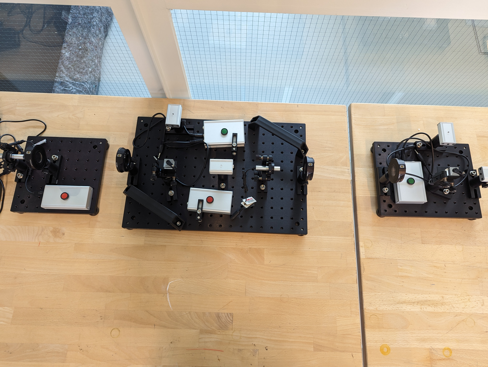
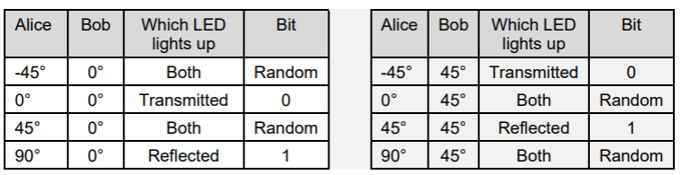
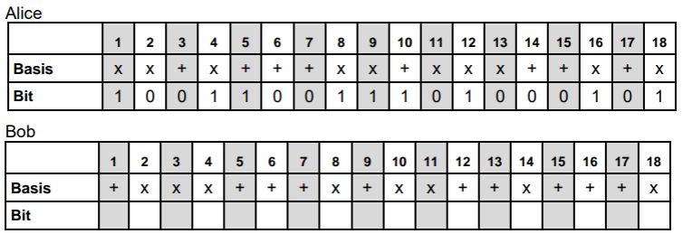

# Quantum Cryptografie met Alice, Bob en Eve
practicumhandleiding 

## Inleiding

In dit experiment wordt onderzocht hoe Quantumcryptografie werkt. In
cryptografie is het gebruikelijk te werken met de denkbeeldige personen
Alice (verzender), Bob (ontvanger) en Eve (evesdropper of afluisteraar).

Alice gaat een versleutelt bericht sturen aan Bob, en Eve gaat dat
proberen af te luisteren, zonder gesnapt te worden.

## Doel

Een versleutelde boodschap versturen met het BB84 protocol en deze
ontvangen en een eventuele afluisteraar snappen.

## Theorie

Kwantumcryptografie is een vorm van beveiliging voor elektronische
communicatie of dataverkeer[^1]. Soms wordt ook gesproken van kwantum
encryptie (hoewel encryptie slechts een deel van het proces is), of
kwantumbeveiliging. Het is onmogelijk om een lijn die gebruikmaakt van
kwantumencryptie af te tappen zonder hierbij gedetecteerd te worden.
Dergelijke beveiligde verbindingen zijn dus niet te kraken. Wordt de
verbinding afgetapt dan kan in een fractie van een seconde een andere
veilige weg gekozen worden. Een slecht beveiligde computer blijft
weliswaar een doelwit, omdat cryptografie alleen de verbinding tussen
computers beveiligt.

Door een sleutel via de beveiligde lijn te versturen kunnen zender en
ontvanger hun boodschap coderen. Kwantumbeveiliging kan garanderen dat
de sleutel enkel bij zender en ontvanger van de boodschap bekend is. Het
populairste protocol daarvoor werd in 1984 door Gilles Brassard en
Charles Bennett gepubliceerd -vandaar de naam BB84- en maakt gebruik van
gepolariseerde fotonen.

De uitgebreide theorie van het BB84 protocol en van de werking van dit
experiment is te vinden in de Thorlabs handleiding, hoofdstuk 5
(Engelstalig). Het experiment kun je uitvoeren zonder heel de theorie
eerst geheel te doorgronden.

## Materiaal

Opstelling met links verzender Alice, in het midden afluisteraar Eve en
rechts ontvanger Bob.



## Uitvoering

We gaan eerst een boodschap versturen zonder Eve. Hierbij gebruiken we
dus alleen Alice en Bob:

### Start & Voorbereiding

1.  Zet Alice en Bob tegenover elkaar, met de rechterkant van Alice
    tegen de linkerkant van Bob. De bovenkanten van Alice en Bob zet je
    tegen Eve aan, zodat ze mooi op één lijn staan.

2.  Zet de voedingen aan. De laser staat nu aan. Let op de veiligheid:
    Kijk niet rechtstreeks in de laser of zijn reflectie en laat deze
    niet op anderen schijnen.

3.  Testen: Zorg dat de laser en de ontvanger in afstel-modus staan:

    1.  De laser van Alice moet continu schijnen: Houdt daartoe zo nodig
        de rode knop circa 20 seconden ingedrukt.

    2.  Op de ontvanger van Bob moet het ledje aan de zijkant oranje
        branden. Druk daartoe zo nodig de groene knop één keer in.

    3.  Zorg dat het draaiding (
        ``` math
        \frac{\lambda}{2}
        ```
        plaat) bij Alice op 45 graden staat en bij Bob op 0 graden.

    4.  De sensors van Bob moet nu even beide (even sterk) belicht
        worden. Komt het laserlicht niet precies in de sensors? Dan is
        de opstelling niet meer goed uitgelijnd. Controleer of Alice en
        Bob echt goed recht staan tegen Eve aan. Ga nooit zomaar ergens
        aan draaien, maar vragen even om hulp. In de meeste gevallen kan
        de laser een klein beetje worden bijgesteld.

        1.  Komt het licht wel goed op de de ontvanger die rechtdoor
            staat? Dan kan het prisma met de stelschroeven op de
            weerkaatste sensor worden gericht.

    5.  Druk nu kort op de rode knop van Alice: De laser staat nu in
        puls-modus.

    6.  Druk nogmaals kort op de knop en als het goed is lichten beide
        blauwe leds op de ontvangers van Bob op.

    7.  Zorg er nu voor dat je rest van de test uitvoert volgens
        onderstaande tabel en de andere 7 uitkomsten hiermee in
        overeenstemming zijn. Let vooral op de gevallen waarin beide
        led’s moeten oplichten.
        

    8.  Het testen is nu klaar, druk eenmaal kort op de groene knop van
        Bob, **zodat het ledje groen wordt. Bob is nu ingesteld op de
        meet-modus.**

### Experiment

Het experiment is verdeeld in drie delen:

1.  Genereren van een sleutel met een lengte van ten minste 20 bits

2.  Versleuteling en verzending van een 4-letterwoord

3.  Installatie van Eve en detectie van een afluisteraar

Om de oefeningen te voltooien, moet de gebruiker bekend zijn met de
encryptieprincipes die in de theorie worden uiteengezet. Een voorbeeld
van een meetprotocol is te vinden in de geprinte bijlage.

#### 1. Sleutelgeneratie 

1.  Zet Alice en Bob neer zoals bij de **Start & Voorbereiding** is
    uiteengezet.

2.  Alice en Bob kiezen willekeurig hun basissen en Alice kiest ook
    willekeurige bits voor de transmissie. De bijlage (geprint) bevat
    een meetprotocol van 52 bits. Vul de bits en basissen in die Alice
    zal gebruiken om haar signaal te verzenden en de basissen die Bob
    zal gebruiken voor detectie. Zie ook hieronder voor een
    voorbeeld.

3.  Zend de bits van Alice in de basissen gekozen bij *b*. Bob noteert
    de bits die hij ontvangt. Bob gebruikt hierbij zijn basissen! (zie
    ook onderaan dit kopje c).

> *Alice en Bob moeten een sleutel genereren die minstens 20 bits lang
> is. We raden aan om een transmissievolgorde van ten minste 52 bits te
> gebruiken. Vanwege het willekeurige karakter van het genereren van een
> sleutel, is een langere transmissie waarschijnlijker om de 20
> overeenkomende basissen te bereiken voor de encryptiesleutel. Tijdens
> deze stap moeten de sensorelektronica’s in meetmodus staan (de
> LED-indicator is groen).*
>
> *Om de keuze van basissen te samenvatten die worden gebruikt bij de
> transmissie:*
>
> *- Als Alice 0° kiest, verzendt ze een 0 in de “+” basis.*
>
> *- Als Alice 90° kiest, verzendt ze een 1 in de “+” basis.*
>
> *- Als Alice -45° kiest, verzendt ze een 0 in de “x” basis.*
>
> *- Als Alice 45° kiest, verzendt ze een 1 in de “x” basis.*

| *Basis Alice* | *Bit Alice* | *Labda Alice instellen op* |
|---------------|-------------|----------------------------|
| *x*           | *0*         | *-45°*                     |
| *x*           | *1*         | *45°*                      |
| *+*           | *0*         | *0°*                       |
| *+*           | *1*         | *90°*                      |

> *Alice en Bob zenden de bits volgens de tabel voorbereid bij b. Alice
> zendt haar bit en Bob noteert zijn meting (**gereflecteerd = 1,
> doorgelaten = 0**).*
>
> ***Bob stelt bij elke transmissie zijn gekozen basis in met zijn
> labda*** ***plaat:***
>
> ***x = 45° en + = 0°.***

4.  Alice en Bob wisselen openbaar de basissen uit die ze bij elke
    meting hebben gebruikt. Ze wissen vervolgens de metingen waar de
    basissen niet overeenkomen. De resterende metingen/bits vormen de
    volledige encryptiesleutel.

> *Alice en Bob wisselen hun basissen uit (“Ik heb + gekozen” of “Ik heb
> x gekozen”) en markeren alle metingen met overeenkomende basissen. De
> corresponderende bits vormen de encryptiesleutel.*
>
> *Als 52 metingen niet voldoende zijn om een encryptiesleutel van 20
> bits te genereren, dan moet de transmissie worden herhaald met meer
> metingen totdat een sleutel van 20 bits is gegenereerd.*

#### 2. Versleuteling en verzending van een vierletterwoord 

> e\. Versleutel het bericht van Alice (4 letters) met de gegenereerde
> sleutel.
>
> f\. Zend het versleutelde bericht van Alice naar Bob.
>
> *De transmissie van het daadwerkelijke bericht wordt volledig
> uitgevoerd in één basis. Alice zendt haar versleutelde bits (0° voor
> 0, 90° voor 1). Alice en Bob veranderen de basis niet voor de
> datatransmissie.*
>
> g\. Decrypt de bits die Bob heeft ontvangen om het bericht van Alice
> te vinden.

#### 3. Toevoegen van Eve en detectie van afluisteren 

1.  Plaats Eve tussen Alice en Bob, en stel beide sensorelektronica's in
    op **afstelmodus (LED licht geel op)**. Stel de ontvanger van Eve zo
    af dat alle 8 transmissiegevallen werken met Alice. Zie tabel:

>  style="width:5.51042in;height:1.41667in" />Stel vervolgens de zender
> van Eve zo af dat alle 8 transmissiegevallen werken met Bob. Zet beide
> sensorelektronica’s terug in meetmodus (LED licht groen op).
>
> *Het doel is om Eve uit te lijnen zonder de opstellingen van Alice en
> Bob te verstoren, aangezien de afluisteraar geen invloed heeft op de
> zender en ontvanger. Zet vervolgens de sensorelektronica’s in
> meetmodus.*

2.  Vul de tabel voor Eve in, die de willekeurige keuze van de + of x
    basis bepaalt. Willekeurige basissen zijn ook nodig voor Alice en
    Bob, en Alice moet willekeurige bits kiezen voor transmissie.

> *Er zijn twee methoden om deze stap uit te voeren. In een ideale
> situatie waarin de gebruikers geïsoleerd zijn, zou Eve gewoon een
> basis spontaan kunnen kiezen en het gemeten resultaat doorzenden.
> Omdat de gebruikers echter in dezelfde ruimte zijn, leidt de fysieke
> handeling van het veranderen van een basis tot een niet-willekeurige
> bias voor de operator van Eve. Het kiezen van willekeurige basissen
> aan het begin van de reeks voorkomt dat deze bias het experiment
> verstoort. Een voorbeeldtabel van basissen die Eve kan gebruiken is te
> vinden in de bijlage. Houd er rekening mee dat de operator van Eve
> geen gegevens hoeft vast te leggen.*

3.  Zend het eerste bit van Alice met de basis gekozen in de vorige
    oefening. Eve kiest haar eerste basis (willekeurig gekozen bij *h*).
    Ze ontvangt een bit dat ze doorgeeft aan Bob met dezelfde basis. Bob
    noteert het bit dat hij ontvangt. Dit wordt uitgevoerd voor alle 52
    bits/basissen in de reeks.

> *Alice en Bob gebruiken dezelfde procedure als bij c. Eve ontvangt het
> signaal van Alice met de willekeurig gekozen basis uit h. Vervolgens
> zendt ze haar meting uit (met dezelfde basis).*

4.  Alice en Bob wisselen openbaar hun basissen uit voor elke meting. Ze
    wissen vervolgens de metingen in de reeks waar de basissen niet
    overeenkomen.

> *Vergelijkbaar met d, vergelijken Alice en Bob hun basissen en
> elimineren ze bits waar de gebruikte basissen niet overeenkomen. Het
> resterende vormt de bitreeks die wordt gebruikt om te testen op de
> aanwezigheid van een afluisteraar.*

5.  Vergelijk de resultaten van Alice en Bob uit *j*.

> *Door het afluisteren van Eve en het uitzenden van bits met een
> willekeurige basis (niet noodzakelijkerwijs identiek aan die van
> Alice), zouden de bitreeksen die zijn vastgelegd door Alice en Bob
> fouten moeten bevatten (bits die niet overeenkomen). De aanwezigheid
> van deze fouten stelt Alice en Bob in staat de aanwezigheid van een
> afluisteraar te detecteren. Dit is anders dan het resultaat van
> Oefening 4, waar Alice en Bob hetzelfde resultaat zouden moeten
> behalen.*

[^1]: Deze informatie (en alinea) is te vinden op Nederlandstalige
    wikipedia pagina over quantumcryptografie
