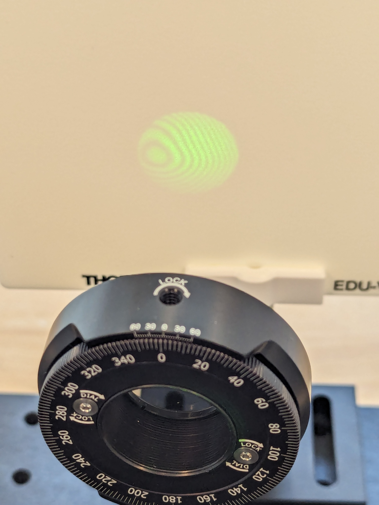

## Inleiding

Na de Michelson interferometer is het principe van Mach Zehnder de
bekendste interferometer. De Mach Zehnder is te herkennen aan de twee halfdoorlatende spiegels (beampsplitters), terwijl de Michelson interferometer er maar één heeft. 

In deze practicumhandleiding worden diverse experimenten uitgevoerd die
van betekenis zijn in de Quantumwereld:

- Interferentie patronen

- Pad informatie

- Quantumeraser

- Delayed Choice

## Doel

Met deze practicumopstelling worden deze experimenten uitgevoerd.

## Theorie

Quantum eraser experiment

Uitgestelde keuze experiment

## Materiaal

Onderstaande opstelling, met daarin:

- Groene laser, met voeding

- Lens

- Halfdoorlatende spiegel (2x)

- Gewone spiegel (2x)

- Instelbare lineaire polarisator (3x)

- Scherm (2x)

- Uitlijntool (1x)

Figuur 1: De Mach Zehnder
opstelling

## Uitvoering

### Veiligheid

Let bij de uitvoering op de veiligheid: Van laserlicht kun je blijvend
blind raken. Ondanks dat deze laser is geselecteerd om mee te werken
zonder extra veiligheidsmaatregelen wordt er toch geacht rekening te
houden met de standaard afspraken wanneer je werkt met laserlicht:

- Zorg dat je nooit rechtstreeks in de laser kijkt of anderen in het
  gezicht schijnt.

- Kijk ook uit met strooi- of gereflecteerd licht.

- De laser wordt dan ook niet gedemonteerd.

## Uitlijning

Zorg dat de interferometer uitgelijnd is en blijft. Wees uitermate
voorzichtig met de opstelling omdat een stootje tegen een van de
elementen betekent dat de interferometer opnieuw moet worden uitgelijnd.

Als de interferometer is uitgelijnd, dan zie je bij het aanzetten een
(bij voorkeur ringvormig) interferentiepatroon:



Figuur 2: Polarisator met daarachter op het scherm een ringvormig
interferentiepatroon.

Een hyperbolisch- of duidelijk lijnenpatroon is ook ok.

Uitlijnen (alleen als dit noodzakelijk is):

Allereerst: Het uitlijnen kost redelijk wat moeite.

- Gebruik het uitlijnhulpmiddel (blokje perspex).

- Verwijder de lens.

- Zorg dat de laser overal precies in het midden op de uitlijntool valt.

- Stel eventueel de eerste halfdoorlatende spiegel en de vaste spiegels.

- Zorg dat de laserpunten op elkaar vallen op de tweede halfdoorlatende
  spiegel.

- Zorg dat de laserpunten zowel dichtbij op de schermen als ver weg
  (minstens 2 meter - op de muur) over elkaar heen vallen door het
  verstellen van de tweede halfdoorlatende spiegel.

# Experiment 1: De twee interferentie patronen

***Verwachting***

Op de foto hierboven is één van de interferentiepatronen zichtbaar. Hoe
verwacht je dat het andere patroon er uit ziet?

***Waarneming***

Zet nu de laser aan en bekijk het scherm.

Komt dit beeld overeen met je verwachting? En hoe wel of niet?

***Uitleg***

Beide interferentiepatronen zijn als het goed is ringvormig, echter het
ene patroon heeft een heldere, middelste cirkel (of plek), terwijl de
andere daar een donkere middelste cirkel heeft.

Bij de ene is het dus een nulde orde maximum door constructieve
interferentie, bij de ander een minimum, door destructieve
interferentie.

Maar waarom is dat verschil er?

**Fase verschuiving verhaal**

# Experiment 2: Pad informatie

In de opstelling zijn 3 (lineaire) polarisatoren opgenomen. Zie ook
figuur 2 voor een afbeelding van een polarisator. De polarisator zorgt
ervoor dat het licht in één richting wordt *gepolariseerd*. In Figuur 3
is de opbouw van een lichtgolf te zien. Alleen lichtgolven met een
``` math
\overrightarrow{E}
```
*-component* in dezelfde richting als de polarisator worden doorgelaten.
Kun je nu uitleggen waarom er dus maar 50% wordt doorgelaten?


Figuur 3: Elektromagnetische (licht)golf. Afbeelding
[Francois~frwiki.](https://en.wikipedia.org/wiki/Polarization_(waves)#/media/File:Electromagnetic_wave2.svg)

Op dit moment staan alle 3 de polarisatoren op 0 graden en dat betekent
dat alleen het licht met een verticale E-component wordt doorgelaten en
het licht wordt verticaal gepolariseerd.

***Verwachting***

Nu gaan we de polarisator in het onderste pad 90 graden draaien.

Wat verwacht je dat er gebeurt met de interferentiepatronen?

***Waarneming***

De interferentiepatronen verdwijnen. Komt dit beeld overeen met je
verwachting? En hoe is dit vanuit de quantummechanica te verklaren?

***Uitleg***

Wanneer we kijken naar één enkel foton voordat we de polarisator
aanpassen, dan zal de golffunctie van dit foton zich verdelen over de
twee paden, voordat het weer samenkomt op het scherm en zichtbaar wordt
als een waarschijnlijkheidsverdeling: Het interferentiepatroon. Er is
hierbij geen enkele kennis over welk pad het foton heeft genomen.

Door de polarisatierichting in onderste arm zodanig aan te passen,
hebben wij informatie over de golffunctie van het foton in het pad. We
kunnen de paden van elkaar onderscheiden: De zogenoemde pad-informatie.
Hierdoor stort de waarschijnlijkheidsfunctie in en treedt er geen
interferentie op.

We kunnen ook zeggen dat door te kijken naar de polarisatie van het
foton, we weten welk pad deze heeft gevolgd: De pad-informatie.

***Vraag***

Wat gebeurt er wanneer de polarisator niet geheel over 90 graden wordt
gedraaid, maar over bijvoorbeeld 75 graden?

***Antwoord***

Bij een polarisator die ingesteld is op 75 graden is de polarisatie
dusdanig, dat er geen 100% duidelijkheid bestaat over de polarisatie
richting van het foton. Er is een kans is dat (de golffunctie van) het
foton kan interfereren: Er zal een interferentiepatroon ontstaan,
alhoewel van zwakke intensiteit.

# Experiment 3: Quantum eraser

We laten de polarisatoren in de twee paden ingesteld zoals bij
experiment 2, maar passen de polarisatierichting van de derde
polarisator, de zogenaamde *eraser*, degene die naast het scherm staat
(zie figuur 2), aan.

***Verwachting***

Wat verwacht je te zien op het scherm als we de *eraser* instellen op 45
graden?

***Waarneming***

We zien dat het interferentiepatroon op het bovenste scherm wel
zichtbaar is, terwijl dit op het linker scherm niet zo is. Hoe valt dit
vanuit de quantummechanica te verklaren?

***Uitleg***

Doordat de *eraser* de pad-informatie (voor één scherm) wist kan er weer
een interferentiepatroon ontstaan: Het is na de *eraser* niet meer te
zeggen of de fotonen het bovenste of onderste pad namen, alle fotonen
zijn 45 graden gepolariseerd.

Bij het andere scherm geldt nog steeds dat de pad-informatie wel bekend
is. Bij het ene pad 0 graden en het andere pad 90 graden polarisatie. Er
is daardoor uiteraard nog steeds geen interferentiepatroon zichtbaar.

# Experiment 4: Delayed-Choice

Dit laatste experiment is een g*edachtenexperiment:*

Zonder de tweede halfdoorlatende spiegel is de pad-informatie bekend en
is er uiteraard geen interferentie mogelijk. Maar stel nu dat we de
tweede halfdoorlatende spiegel pas in de opstelling plaatsen, als het
foton voorbij de eerste halfdoorlatende spiegel is.

***Verwachting***

Zal er een interferentiepatroon zichtbaar zijn en waarom?

***Waarneming***

Ja, er is een interferentiepatroon zichtbaar.

***Uitleg***

Klassiek gezien kiest het foton een pad na de halfdoorlatende spiegel.
Echter in de quantummechanica kiest het foton geen pad, maar de
golffunctie verdeeld zicht over de twee paden. We weten pas het pad van
het foton als we een waarneming doen.

De tweede halfdoorlatende spiegel zal vervolgens worden geplaatst en
deze zal ervoor zorgen dat de verdeelde golffunctie van het foton weer
samenkomt op het scherm en zichtbaar wordt als een
waarschijnlijkheidsverdeling: Het interferentiepatroon. Er is hierbij
geen enkele kennis over welk pad het foton heeft genomen.
