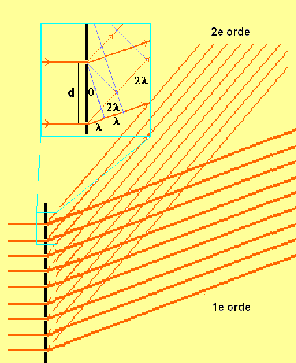
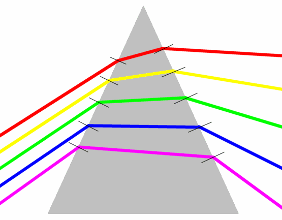
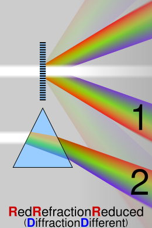
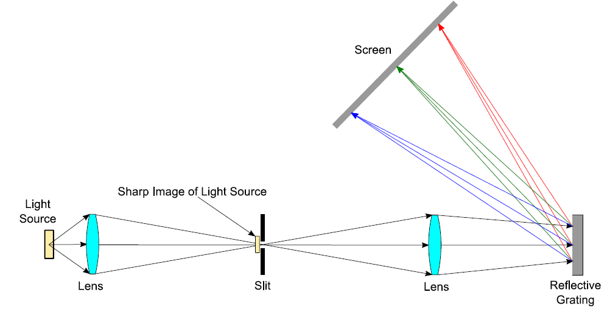
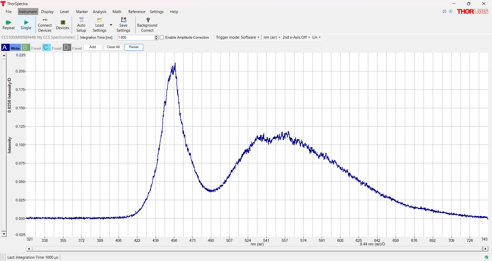
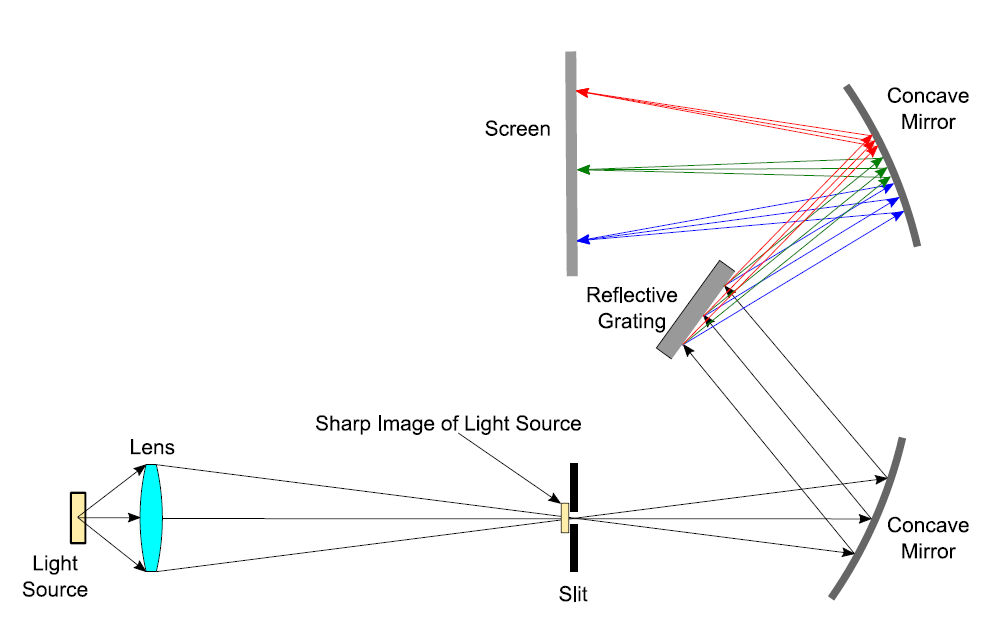
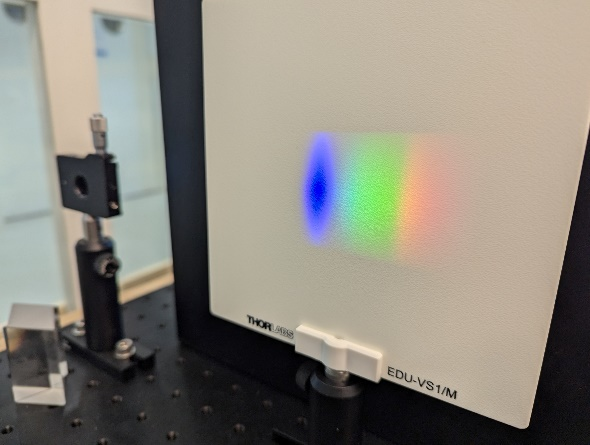
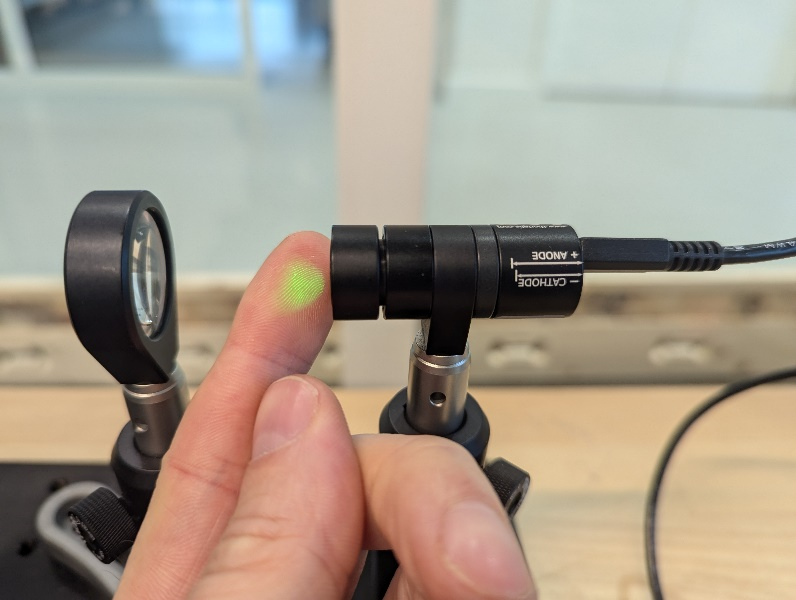
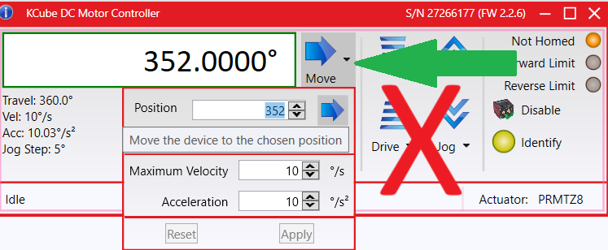

# Spectrometer(s) 
practicumhandleiding

## Inleiding

Dit is de handleiding van zowel het experiment met de gewone
spectrometer (11a) en van de Czerny-Turner spectrometer met motor
gestuurde tralie (11b).

Met een spectrometer kan de golflengte worden gevonden die wordt
uitgezonden bij het terugvallen van een elektron naar lager
energieniveau.

Hiermee kan het emissiespectrum van gassen of het absorptiespectrum van
vloeistoffen worden geanalyseerd. Ook kan hier bijvoorbeeld het
noorderlicht mee kunnen worden onderzocht.

## Doel

Het doen van een aantal experimenten met de spectrometers om te
achterhalen:

- Hoe werken de verschillende spectrometers?

- Hoe kun je met elke spectrometer de golflengte bepalen?

- Hoe kun je dit het nauwkeurigst doen of welke is het nauwkeurigst?

- Hoe kun je de n bepalen van kroonglas van een prisma?

## Hypothese

Welke spectrometer werkt het nauwkeurigst denk je en waarom?

## Theorie

Het doel van elke spectrometer is om het spectrum van een lichtbron te
vinden. Met behulp van deze spectrometer kan het spectrum niet alleen
zichtbaar worden gemaakt zoals met een zakspectrometer, maar kan de
golflengte ook daadwerkelijk worden berekend.

Elke spectrometer bestaat uit een manier om het licht van de lichtbron
op te vangen, waarna het via een optisch element wordt geleid dat de
licht anders buigt of breekt naar gelang de golflengte (een tralie,
prisma of spiegeltralie). Tenslotte wordt dit licht opgevangen,
bijvoorbeeld op een scherm of op een sensor.

### Tralie

In de figuur hieronder is de
werking van een tralie uitgebeeld. 
<br>

<br>
Hierin is:

$d =$ tralieafstand

$\lambda =$ golflengte

$\theta =$ hoek van buiging

En wordt met 1<sup>e</sup> orde en 2<sup>e</sup> orde de maxima bedoeld
waar constructieve interferentie optreedt door *n*$\lambda$ weglengte
verschil.

*Door Oscar2 op de Nederlandstalige Wikipedia, CC BY-SA 3.0,
<https://commons.wikimedia.org/w/index.php?curid=3218724>*

De tralieafstand *d* kan gevonden worden als je het aantal *N* lijnen of
spleten van de tralie weet. $d = \frac{1}{N}$

Alleen bij enkele hoeken $\theta$ treedt er voor de gebroken
lichtstralen constructieve interferentie op en is een maximum te vinden
(1e orde maxiumum, 2e orde maximum, etc.)

Dit verband wordt weergegeven in de volgende formule:

$sin\theta = \frac{n\,\lambda}{d}$, waarin n = maximum 0,1,2,3
etc.

En kan ook worden geschreven als:
```{math}
:label: 1
\sin\theta = n\cdot\lambda\cdot N
```

Uit deze formule kan $\lambda$ worden berekend.

### Prisma

Bij een tralie treedt *buiging* van licht op, bij een prisma daarentegen
*breking*. De brekingshoek kan worden berekend met behulp van de wet van
Snellius:

```{math}
\frac{\sin i\,}{\sin r} = n
```

Hierin is:

*i* de hoek van inval, *r* de hoek van breking (refractie) en *n* de
brekingsindex van het materiaal. Aangezien de brekingsindex voor elke
golflengte (en elk materiaal) anders is, zal bijvoorbeeld witlicht
breken in zijn spectrum. Zie de figuur hieronder.



*CC BY-SA 2.0 at,
https://commons.wikimedia.org/w/index.php?curid=223136*

Als de lichtstraal van glas naar lucht gaat kan er totale terugkaatsing
optreden. Dit gebeurt als de hoek van inval groter is dan de grenshoek
van het materiaal. Er geldt voor grenshoek gamma $`\gamma`$:

```{math}
n = \frac{1}{\sin\gamma}
```

#### Vergelijking tralie en prisma

In de figuur hieronder zie je het verschil in resultaat tussen buiging
(1) en breking (2).



*By Cmglee - Own work, CC BY-SA 3.0,
https://commons.wikimedia.org/w/index.php?curid=19051904*

<span id="_Toc340567598" class="anchor"></span>Materiaal

### Experiment 11a:



*Figuur van Thorlabs*

Bij experiment 11a is de *reflective grating (spiegel tralie)* in het
plaatje hierboven inwisselbaar voor één met 1200 lijnen/mm, 600
lijnen/mm of een prisma.

Als lichtbron wordt gebruik gemaakt van een witte LED. Het is mogelijk
deze LED te voorzien van een groen bandpass filter van 532nm. De witte
LED heeft het volgende spectrum:



### Experiment 11b:

Hier wordt gebruik gemaakt van een Czerny-Turner spectrometer. Hieronder
zie je de opstelling.



*Figuur van Thorlabs*

Bij experiment 11b is de spiegel tralie gemonteerd op een gemotoriseerd
platform. Dit platform wordt met de Thorlabs software *Kinesis*
aangestuurd.

## Uitvoering - Experiment 11a

Experiment 11a

### Proef 1:

1.  Plaats de tralie met 600 lijnen/mm (staat op zijkant) zodanig in de
    opstelling dat het spectrum van de witte led wordt geprojecteerd op
    het witte scherm voor de zwarte plaat.

2.  Probeer het midden van de blauwe vlek te vinden. Dit wordt
    nauwkeuriger als je de spleetbreedte kleiner maakt (draai nooit te
    strak, dan gaat het kapot). Als de spleetbreedte kleiner wordt,
    wordt de afbeelding donkerder. Probeer een optimum te vinden.

```{figure} ./media/simage8.png
    ---
    width: 50%
    name: meten
    align: right
    ---
    Afbeelding van Thorlabs
```
3.  Meet van het midden van de spleet tot het midden van de blauwe vlek
    met de liniaal.

4.  Meet tevens de afstand van de spleet tot tralie zo nauwkeurig mogelijk van bovenaf (maar
    raak de tralie absoluut niet aan).

5.  Bereken vervolgens hoek $`\theta`$ . Bedenk dat geldt:
    $tan\theta = \frac{y}{x}$. Zie ook de afbeelding hiernaast.

6.  Bereken tenslotte de golflengte $lambda$ met formule (1).

7.  Vergelijk je resultaat met het spectrum van de witte LED uit de
    theorie.

8.  Herhaal deze proef met de tralie van 1200 lijnen/mm.

9.  Welk resultaat is nauwkeuriger?


ZOZ

### Proef 2:

- Schroef vervolgens het groene bandpass filter voor op de witte LED.
  Zie hieronder.



- Herhaal vervolgens de stappen van proef 1 voor dit filter.

### Proef 3:

De theoretische kleinst scheidende vermogen van een tralie kan worden
berekend met:

```{math}
\frac{\lambda}{\Delta\lambda} = N
```

Waarbij $\Delta\lambda$ de kleinst waar te nemen golflengte stap is.

Welke tralie is volgens de formule het “best”?

ZOZ

### Proef 4:

Bij deze proef gaan we de brekingsindex bepalen van het prisma, dat
gemaakt is van kroonglas.

1.  Plaats nu het prisma in de opstelling en verplaats het scherm. Zie ook de
    foto hieronder. De matte kant van het prisma wijst naar jou. Laat
    echter het filter op de LED zitten, dus zo’n mooi spectrum als op de
    foto is niet waarneembaar. (Op de foto is wel mooi zichtbaar dat de
    kleuren andersom zijn ten opzichte van proef 1).

```{figure} ./media/simage10.jpeg
---
width: 60%
name: prisma
align: right
---
prisma
```

2.  Draai nu het prisma een klein beetje heen en weer, waarbij de ene
    keer er geen breking zichtbaar is op het scherm: (de lichtstraal
    wordt in het prisma teruggekaatst, er treedt totale terugkaatsing
    op. De hoek van inval is hierbij groter dan de grenshoek.) en de
    andere keer is er wel breking zichtbaar op het scherm (De hoek van
    inval in het prisma is kleiner dan de grenshoek. De treedt breking
    op, de lichtstraal verlaat het prisma).

- Probeer precies het punt of de positie te vinden dat er net wel
  breking optreedt.

3.  Meet de afstanden x en y zoals hieronder zijn aangeven. Let op: Zorg
    dat je x en y meet met een rechte hoek (90° ) ertussen. En bereken
    vervolgens hoek $\gamma$ gamma. 

```{figure} ./media/simage11.png
---
width: 100%
name: grenshoek
align: center
---
Afbeelding van Thorlabs
```
    


4.  Bereken hieruit de brekingsindex.

```{math}
n = \frac{1}{\sin\gamma}
```


5.  Vergelijk de gevonden waarde voor de brekingsindex *n* met de
    theoretische voor het gebruikte kroonglas: *n*=1,626 .

6.  Zit je er heel erg naast? Meet dan eens opnieuw.

## Uitvoering - Experiment 11b

Bij het uitvoeren van dit experiment zijn een aantal zaken belangrijk:

- De motor wordt aangezet met het kleine oranje schakelaartje op de
  motorsturingkubus. Controleer of het rotatieplatform bij het aanzetten
  op 0<sup>°</sup> staat, de kubus start namelijk bij 0<sup>°</sup>. 🡪
  Zet dus de kubus alleen uit als het rotatieplatform op 0<sup>°</sup>
  staat. Verbreek het USB contact dus ook niet tussendoor.

- Zorg dus dat de laptop niet op STANDBY kan gaan.

- Besturing van het automatische rotatie platform gaat via de Kinesis
  software op de laptop (Gebruik de knoppen op de motorsturingkubus niet
  om desychronisatie te voorkomen).

- Gebruik enkel de Move functie in de software:
  

- De kleinste stapgrootte is 0.02<sup>°</sup>, maar een kleinste
  stapgrootte van 0.1 volstaat over het algemeen. Je kunt daarvoor de
  kleine zwarte pijltjes omhoog en omlaag gebruiken.

- Zet de multimeter in de mVdc stand.

- Er is ook een IR detector (PM16-122) voor IR bronnen die je kunt
  uitlezen met de software *Thorlabs Optical Power Monitor*. Deze IR
  detector is in de huidige opstelling NIET nodig.

Hieronder volgen de werkelijke stappen van de proeven die horen bij
experiment 11b.

### Proef 5:

1.  Plaats het witte scherm van experiment 11a voor de tweede spleet (de
    exit spleet, degene het dichtst bij je).

2.  Zoek met de software (zie stappen hierboven) de hoek waarbij het
    spectrum ongeveer op het scherm valt.

3.  Verwijder nu het witte scherm

4.  Zoek de hoek waarbij de grootste spanning wordt weergegeven op de
    voltmeter. Bij welke kleur is dat?

####  Proef 6:

1.  Schroef het groene bandpass filter op de witte LED.

2.  Begin bij 0 graden, hierbij zou het nulde orde maximum in de exit
    spleet zichtbaar moeten zijn en hierbij moet dus een (kleine)
    spanning worden gemeten.

3.  Zoek nu het 1<sup>e</sup> orde maximum door met de software de
    traliespiegel te draaien. Als hulp kun je naar de achterkant van de
    exit spleet kijken, desnoods met behulp van het witte scherm. Als de
    het maximum precies in de spleet valt heb je de juiste hoek
    $\alpha$ gevonden en meet je een spanning.

4.  Bereken nu de golflengte van het licht met behulp van
    $alpha_{cal} = 25{^\circ}$ (eerder al bepaald)

    En de formules:

    ```{math}
    \Theta = - 2\alpha_{cal}
    ```

    ```{math}
    \lambda = \frac{sin(\Theta + \alpha)}{N}
    ```

5.  Vergelijk je gevonden waarde met de theoretische golflengte 532nm
    van het bandpass filter

6.  Extra: Zoek het tweede orde maximum en voer hiervoor ook de
    berekening uit. Klopt dit?

- Klaar? **Zet de software op 0 graden** en verifieer dat het platform
  op 0 graden staat voordat je de software afsluit.

## Resultaten

Verzamel je resultaten in je logboek.

<span id="_Toc692617926" class="anchor"></span>Conclusie

Geef hieronder je conclusies met betrekking tot het doel van de proef.

Welke spectrometer werkt het nauwkeurigst? Waarom?

## Ideeën:

- Gebruik als lichtbron een Natriumlamp (Dit is niet te realiseren met
  de huidige opstelling).

- Meet het absorbtiespectrum van een vloeistof (bijvoorbeeld
  rodekoolsap).
