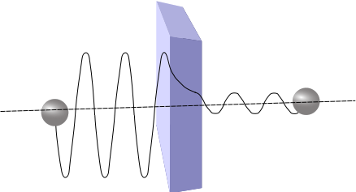

# Tunnelen 
practicumhandleiding

## Inleiding

Uit de quantummechanica weten we dat elektronen kunnen tunnelen. Licht
(fotonen) vertonen soortgelijk gedrag. Met deze proef kan het
tunneleffect worden gedemonstreerd.

## Doel

Het aantonen van het tunneleffect aan de hand van fotonen die door een
barrière tunnelen. De barrière bestaat uit een driehoekige luchtspleet
tussen twee prisma’s.

We doen dit door de positie van de prisma’s en dus de luchtspleet ten
opzichte van de laser te verplaatsen en daarbij telkens de transmissie
te meten.


## Hypothese

Wat zijn je verwachtingen met betrekking tot de resultaten?

## Theorie



Figuur geeft de golffunctie weer van een deeltje dat door een barrière
tunnelt. Bron: <https://snl.no/kvantemekanisk_tunnelering> (public
domain).

In de quantummechanica is het mogelijk dat deeltjes met een kleinere
energie dan de potentiële energie van een barrière, deze barrière toch
kunnen passeren. Er is een kans of waarschijnlijkheid dat we het deeltje
aan de andere kant van de barrière aantreffen. Dit noemen principe
noemen we *tunnelen*.

De tunnelkans *T* wordt weergegeven in onderstaande formule:

```{math}
T = e^{- 2d\sqrt{\frac{4\pi m\left( E_{pot} - E \right)\,}{h^{2}}}}
```

*d* = dikte van de barrière

*m* = massa van het deeltje

*E<sub>pot</sub>* = potentële energie of hoogte van de barrière

*E* = energie van het deeltje

*h*= constante van Planck

Wanneer is de tunnelkans groter:

- Als de massa kleiner/gelijk/groter is?

- Als de *E<sub>pot</sub>* kleiner/gelijk/groter is?

- Als breedte van de barrière *d* kleiner/gelijk/groter is?

In de optica treedt er totale reflectie op als de hoek van inval groter
is dan de grenshoek van het materiaal (Weet je niet precies wat dit is,
kijk dan eerst naar:
<https://www.walter-fendt.de/html5/phnl/refractionhuygens_nl.htm>)

Zoek in Binas, tabel 18, op wat de grenshoek is van normaal glas. Komt
dit overeen met de hoek van de spleet ten opzichte van de laser?

Op de plek waar de twee prisma’s tegen elkaar zitten, (zie bovenste
figuur), is er sprake van volledige transmissie, de lichtstraal kan
gewoon rechtdoor. Verplaats je het dubbele prisma ten opzichte van de
laser echter naar links, dan zal er totale reflectie optreden bij deze
hoek van inval die precies gelijk is aan de grenshoek, omdat er nu een
luchtspleet zit. Toch zal er een klein beetje licht door de luchtspleet
“tunnelen” en doorgelaten worden (transmissie).

Tunnelen met fotonen is niet helemaal hetzelfde als tunnelen met
elektronen. Het is een kwalitatieve vergelijking: Wat zijn de
overeenkomsten en verschillen met een elektron dat tunnelt door een
barrière?

Geef antwoord op de volgende vragen bij dit experiment:

- Wat bepaald de energie van het foton?

- Wat bepaald de hoogte van de barrière?

- Wat bepaalde de dikte?

- Wat bepaald de tunnelkans?

## Materiaal


- Groene 532 nm laser

- Twee polarisatiefilters om het licht af te zwakken (eventueel nodig)

- Thorlabs fotodiode met 532 laserlijnfilter

- Multimeter (mV)

- Twee prisma’s met spleet in een 3D-geprinte houder op een lineaire
  slede (slider)

## Uitvoering

### Veiligheid

Let bij de uitvoering op de veiligheid: Van laserlicht kun je blijvend
blind raken. Ondanks dat deze laser is geselecteerd om mee te werken
zonder extra veiligheidsmaatregelen wordt er toch geacht rekening te
houden met de standaard afspraken wanneer je werkt met laserlicht:

- Zorg dat je nooit rechtstreeks in de laser kijkt of anderen in het
  gezicht schijnt.

- Kijk ook uit met strooi- of gereflecteerd licht: **Het gereflecteerde
  licht komt recht op je af.**

De uitvoering in stappen:

1.  Zet de laser aan

2.  Sluit de multimeter aan en stel deze in op mV.

3.  Zet het tunneldevice – de gekoppelde prisma’s - in de beginpositie
    door de micrometer zodanig te verdraaien dat de laser op de plek
    valt waar de spleet tussen de prisma’s minimaal is. Dit is de kant
    die naar jou gericht is. Er zal hier voor bijna 100% transmissie
    plaatsvinden. Dit is bijna de uiterste stand van de micrometer
    draaiknop. Zorg dat deze op 0 staat. Noteer de spanning.

4.  Draai de micrometer draaiknop telkens één hele slag tegen de klok in
    (van 0 tot 0) en noteer de spanning die op de fotodiode staat.

5.  En scan zo, als het ware, de spleetbreedte tussen de prisma’s.

## Resultaten

Maak een tabel en zet daarin voor elke slag met de draaiknop de gemeten
spanning.

Zet de gegevens uit de tabel uit in een grafiek: Horizontaal het aantal
slagen, verticaal de transmissie of spanning in mV.

## Conclusie

Geef hieronder je conclusies met betrekking tot het doel van de proef.

Wat voor verband of functie kun je herkennen in je grafiek?

Klopt dit met je verwachtingen? Waarom wel of niet?

Voeg dit functieverband toe om zo een functiefit te krijgen (een
vloeiende lijn door je meetgegevens).

## Ideeën:

- Resonant optical tunneling effect: Twee barrière’s, die resonantie
vertonen bij bepaalde frequenties.
- Tunnelen met microgolven
- Tunneldiode
